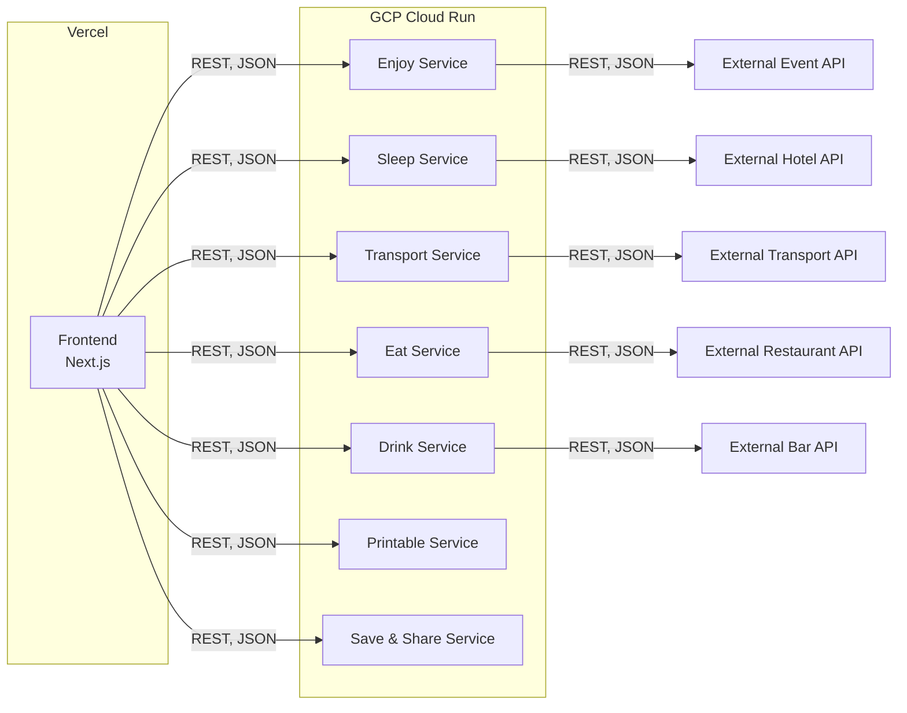

# EpicRoadTrip

## Description

EpicRoadTrip is a web application that allows you to plan a trip in a few clicks.

You can search for a destination, and the application will suggest you a list of activities, restaurants, hotels, etc.
You can also get an itinerary for your trip.

When users enter keywords, corresponding to a location (or elsewhere), your web app takes care
of everything so that they only have to choose, chill, eat, drink, sleep, and have fun.

## Tech Stack

- Frontend: [Nextjs](https://nextjs.org/)
- Backend: [Go](https://go.dev/) + [Gin](https://github.com/gin-gonic/gin)

## Architecture

Epic Road Trip uses a microservice architecture, the project is broke down into individual microservices that will handle specific features. Each microservice is responsible for a single piece of functionality, communicating with the others through APIs.

Each microservice is deployed on [Google Cloud Run](https://cloud.google.com/run) and is accessible through a REST API.

The frontend is a [Next.js](https://nextjs.org/) application that will communicate with the microservices through REST APIs.

Here's a high-level diagram of the proposed architecture:

## Team

- [Marius Glo](https://github.com/mgl)
- [Quentin Andreani](https://github.com/qandreani)
- [Voltaire Perrochaud](https://github.com/Voltaire-Perrochaud)
- [Gildas Gonzales](https://github.com/GildasGonz)
