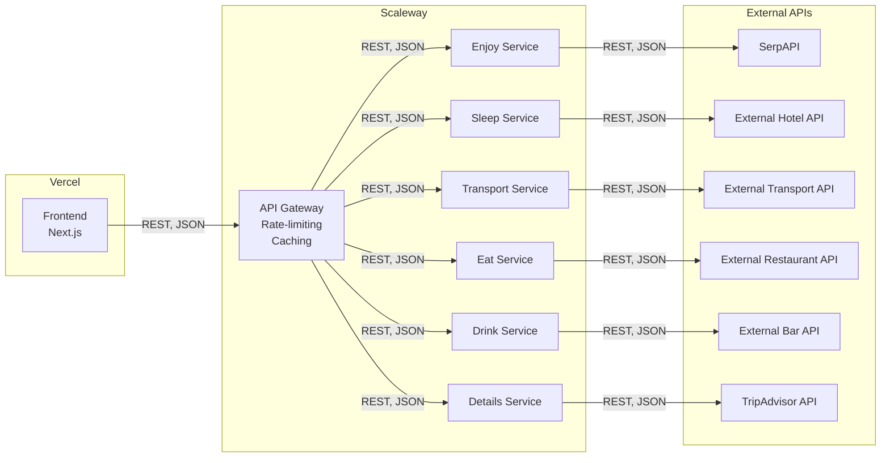

# EPIC ROAD TRIP

https://epic-road-trip-mu.vercel.app/

## Table of Contents

- [EPIC ROAD TRIP](#epic-road-trip)
  - [Table of Contents](#table-of-contents)
  - [Status](#status)
  - [Introduction](#introduction)
  - [User Stories](#user-stories)
  - [Functional Tests](#functional-tests)
  - [Architecture](#architecture)
  - [API Specifications](#api-specifications)
  - [External APIs and Microservices](#external-apis-and-microservices)
  - [Test Driven Development](#test-driven-development)
  - [Documentation](#documentation)
  - [Automation](#automation)
  - [UI / UX](#ui--ux)
  - [Bonus Features](#bonus-features)
  - [Team](#team)

## Status

Frontend deployment: <https://epic-road-trip-mu.vercel.app/>

Gateway deployment: <http://163.172.137.43/>

| Workflow | Status | Platform |
| - | - | - |
| Backend build | Ubuntu | 
| Frontend build | Ubuntu | 
| CodeQL | None | 
| Coverage | Ubuntu | [](https://codecov.io/gh/EpicRoadTrip/EpicRoadTrip)
| Lint backend | Ubuntu | 
| Lint frontend | Ubuntu | 
| Unit tests frontend | Ubuntu | 
| Unit tests backend | Ubuntu | 

## Introduction

Epic Road Trip is a web application that aims to provide an effortless trip planning experience for users. By gathering information from various external APIs and microservices, the application allows users to input their preferences and receive tailored suggestions for accommodations, events, restaurants, bars, and transport options.

## User Stories

1. As a user, I want to input one or more locations to plan my trip.
2. As a user, I want to refine my search results according to dates, budget, area, and other constraints.
3. As a user, I want to receive suggestions for cultural and sporting events.
4. As a user, I want to receive proposals for accommodations, restaurants, bars, and transport options.
5. As a user, I want to visualize multiple information and events on a map.
6. As a user, I want to receive itinerary suggestions between two points.
7. As a user, I want to get a printable version of my trip's details, with maps.
8. As a user, I want to save my search for future reference or to share it with others.

## Functional Tests

1. Verify the user can input one or more locations.
2. Verify the user can refine search results according to constraints.
3. Verify the user receives event suggestions.
4. Verify the user receives accommodation, restaurant, bar, and transport proposals.
5. Verify the user can visualize information and events on a map.
6. Verify the user receives itinerary suggestions between two points.
7. Verify the user can get a printable version of their trip's details, with maps.
8. Verify the user can save their search and share it.

## Architecture

The application's architecture consists of a frontend built with Next.js, and backend services built with Go and the Gin framework.

The frontend communicates with the backend services via API calls. The backend services fetch data from external APIs such as TripAdvisor and Google, process the data, and return the results to the frontend.

Continuous integration and deployment are managed using Github Actions. The frontend is deployed to Vercel, while the backend microservices are deployed on Scaleway.

The gateway service is responsible for routing requests to the appropriate backend service. It rates limits requests to prevent abuse. It also caches responses to reduce the number of requests to external APIs.

The rate limit is set to 10 requests per second. The cache is set to expire after 1 hour.

Here's a high-level diagram of the architecture:



## API Specifications

The API consists of the following endpoints:

```text
GET /events/:location?constraints - List of existing events and activities.

GET /accomodations/:location?constraints - List of available accommodations.

GET /bars/:location?constraints - List of available bars.

GET /restaurants/:location?constraints - List of available restaurants.

GET /details/:placeId - Get the details of a specific event, accommodation, restaurant, or bar.

GET /transports/:location?constraints - List of available transports.
```

Each endpoint accepts a JSON object in the request body containing a location and an optional constraints field. The constraints field can be used to refine the search results according to dates, budget, area, and other constraints.

More detailed information on the API can be foudn in the Swagger documentation of each service.

## External APIs and Microservices

The application relies on external APIs such as TripAdvisor and Google to fetch data on events, accommodations, restaurants, bars, and transport options. These APIs are accessed through the backend services, which process the data and return the results to the frontend.

To utilize these external APIs, API keys and proper authentication are implemented. The backend services are responsible for handling these tasks and ensuring that the information is retrieved and displayed on the frontend in a user-friendly manner.

## Test Driven Development

Epic Road Trip follows the Test Driven Development (TDD) methodology, which involves writing tests before implementing the actual functionality. This ensures that the application meets the expected requirements and minimizes the risk of introducing bugs during development.

The frontend uses Jest for testing, while the backend employs testify. By following TDD, we ensure that the application is stable, reliable, and functioning as intended.

Development follows the Git Flow and Test Driven Development methodologies. Unit tests are performed using Jest for the frontend and testify for the backend.

## Documentation

To ensure the API can be easily utilized by other developers, thorough documentation is provided. This documentation includes details on each endpoint, the required parameters, and the expected response format.

Swagger is used to generate interactive documentation that allows users to explore and test the API endpoints directly.

## Automation

To facilitate error detection and streamline the development process, several tasks are automated. These tasks include launching tests, generating documentation, and deploying the production site.

We use Github Actions to manage and automate these tasks, so developers can focus on implementing new features and improving the application.

## UI / UX

User Interface (UI) and User Experience (UX) are crucial aspects of Epic Road Trip. The application must be easy to access, understand, and navigate. Information should be presented clearly, and users should be able to find what they're looking for quickly.

The application is also designed to be responsive and reactive, ensuring that it functions well on both desktop and mobile devices.

## Bonus Features

There are several ways to improve and expand upon Epic Road Trip:

1. Consume additional microservices to provide more information and options to users.
2. Implement new features that further enhance the trip planning experience.
3. Integrate a payment microservice to allow users to book accommodations, events, and transport directly through the app.
4. Add user-generated content such as videos and reviews to provide more information and context for users.
5. Allow users to plan trips to fictional locations, like Tatooine or Dagobah.
6. Reverse the planning process, enabling users to choose an event first and then find suitable locations.
7. Increase the security of the application to better protect user data and privacy.

## Team

- [Marius Glo](https://github.com/mgl)
- [Quentin Andreani](https://github.com/qandreani)
- [Voltaire Perrochaud](https://github.com/Voltaire-Perrochaud)
- [Gildas Gonzales](https://github.com/GildasGonz)
