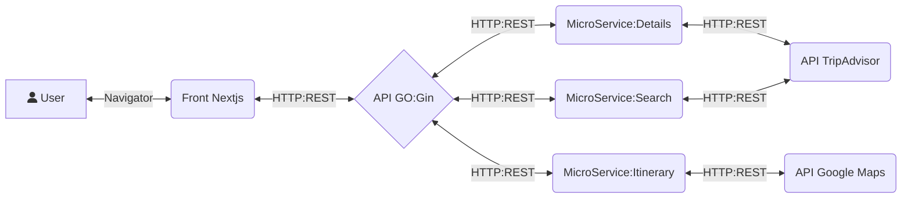

# EpicRoadTrip

## Schéma d'architecture 

```mermaid
graph LR;
    A[fa:fa-user User] <--> |Navigator| B(Front Nextjs);
    B <--> | HTTP:REST | C{API GO:Gin};
    C <--> | HTTP:REST | D(MicroService:Search);
    C <--> | HTTP:REST | E(MicroService:Details);
    C <--> | HTTP:REST | H(MicroService:Itinerary);
    E <--> | HTTP:REST | F(API TripAdvisor);
    D <--> | HTTP:REST | F(API TripAdvisor);
    H <--> | HTTP:REST | G(API Google Maps);
```